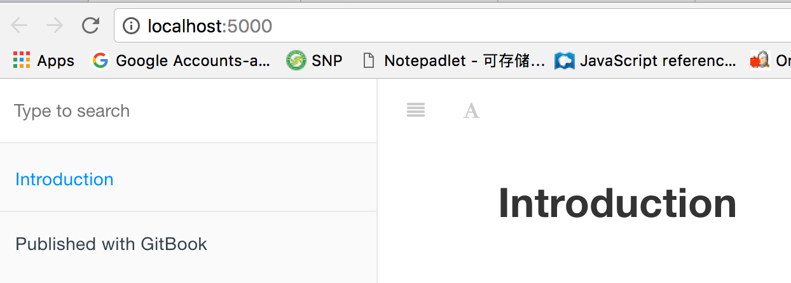

## 初始化环境 
```
$ docker run --rm -v "$PWD:/gitbook" -p 5000:4000 billryan/gitbook gitbook init
Unable to find image 'billryan/gitbook:latest' locally
latest: Pulling from billryan/gitbook
5c90d4a2d1a8: Pull complete
ab30c63719b1: Pull complete
c6072700a242: Pull complete
abb742d515b4: Pull complete
22efa86cdb65: Pull complete
dc09101fb56d: Pull complete
37960bf9ade1: Pull complete
35e32f985324: Pull complete
6489adfcf0ab: Pull complete
f15061b42776: Pull complete
Digest: sha256:cfef3f01324f2071718a20273abd16def88200ae84044eedbad219e12e392809
Status: Downloaded newer image for billryan/gitbook:latest
warn: no summary file in this book
info: create README.md
info: create SUMMARY.md
info: initialization is finished
```

这条命令会生成两个文件：README.md和SUMMARY.md文件。我们可以运行来看看它们的结果：

```
$ docker run --rm -v "$PWD:/gitbook" -p 5000:4000 billryan/gitbook gitbook serve
Live reload server started on port: 35729
Press CTRL+C to quit ...

info: 7 plugins are installed
info: loading plugin "livereload"... OK
info: loading plugin "highlight"... OK
info: loading plugin "search"... OK
info: loading plugin "lunr"... OK
info: loading plugin "sharing"... OK
info: loading plugin "fontsettings"... OK
info: loading plugin "theme-default"... OK
info: found 1 pages
info: found 0 asset files
info: >> generation finished with success in 0.8s !

Starting server ...
Serving book on http://localhost:4000
```

我们使用浏览器访问， 可以看到如下结果：


注意端口是5000，提示信息中的4000，是容器内部的端口。


